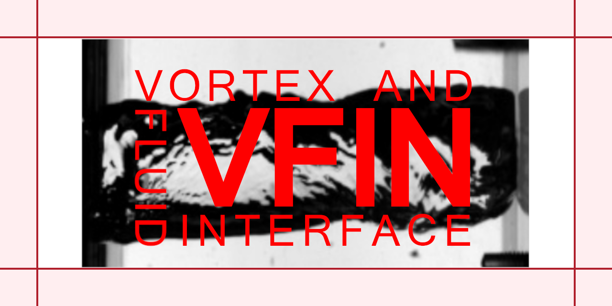
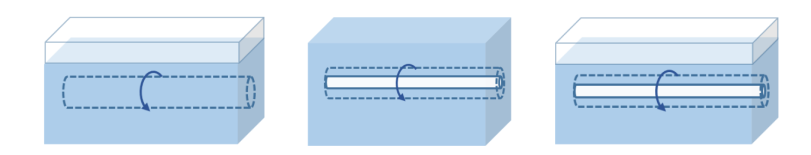

# ANR project VFIN: Vortices and Fluid INterface

## Welcome on the website of the ANR Project VFIN: Vortices and Fluid INterface

The partners of this project are the following labs:
- [Institut Jean le Rond d'Alembert](http://www.dalembert.upmc.fr/ijlrda/), Sorbonne Université, Paris.
- [LMFA](http://lmfa.ec-lyon.fr), Ecole Centrale de Lyon, CNRS, Université Claude Bernard, INSA Lyon.
- [IRPHE](https://irphe.univ-amu.fr), Aix-Marseille Université, CNRS, Ecole Centrale Marseille.

The project will last 4 years starting from January 1st, 2025.

## What is the ANR-VFIN project?

Many situations involve **flow vortices** in which **several immiscible fluids** are present: floating bodies, bodies immersed at small depth, foils, propellers... The presence of a **gas/liquid interface** located either in
the vicinity of the vortex or within its core, crucially modifies the dynamics. 

To study vortices with interfaces, we focus on **three prototype settings** represented below:

1. A vortex under a free surface
2. A vortex with a gaseous core
3. A vortex with a gaseous core interacting with a free surface

We will use **theory, numerical simulation and experimentation** to study these three situations.
